# Phase 1 File Transfer Test

Following the instructions of the project, we set up the SRFT client and server on two separate machines in the same VPC. For phase 1, we did not enable encryption to focus on the reliability of the file transfer under packet loss conditions.

## File Size Performance

```sh
# Example: Testing the SRFT client and server with a 100MB file transfer

# On the server machine (test files are in the home directory)
# Simulate 2% packet loss
sudo tc qdisc add dev enX0 root netem loss 2%
sudo python3 src/SRFT_UDPServer.py "172.31.17.138" ~/ --insecure

# On the client machine
sudo SERVER_IP=172.31.17.138 CLIENT_IP=172.31.26.144 python3 src/SRFT_UDPClient.py test_100mb_file --insecure
```

| File Name       | Server Report Screenshot     | Client Report Screenshot     | Time     |
| --------------- | ---------------------------- | ---------------------------- | -------- |
| test_10mb_file  | 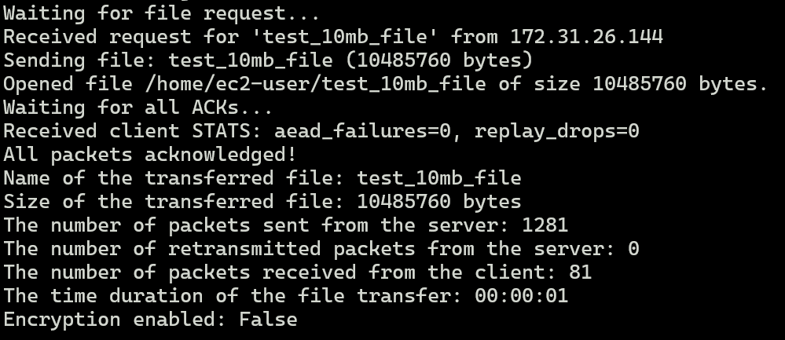  | 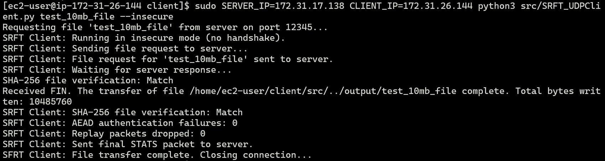  | 00:00:01 |
| test_100mb_file | 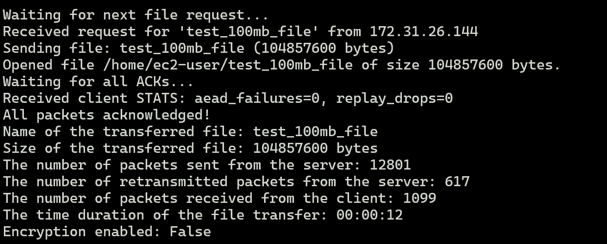 | 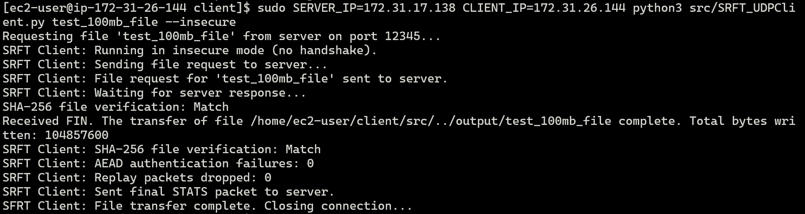 | 00:00:12 |
| test_500mb_file | 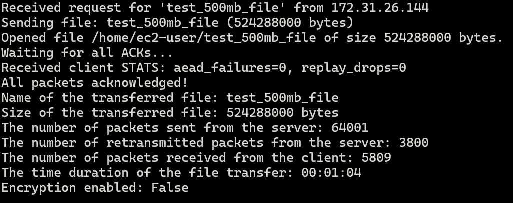 | 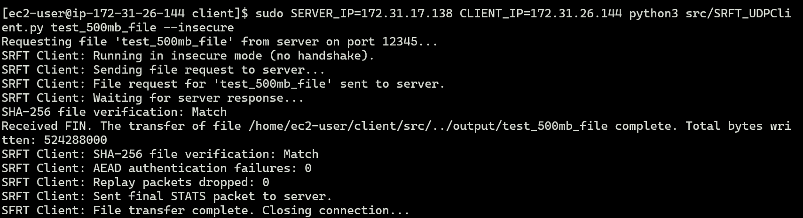 | 00:01:04 |
| test_800mb_file | 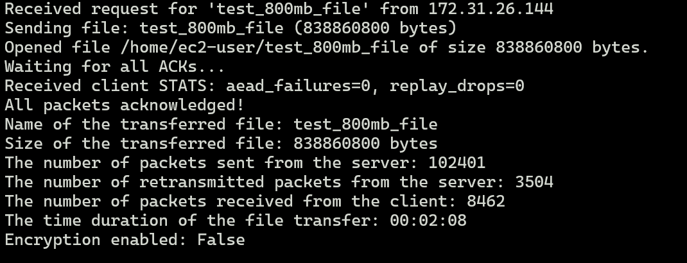 | 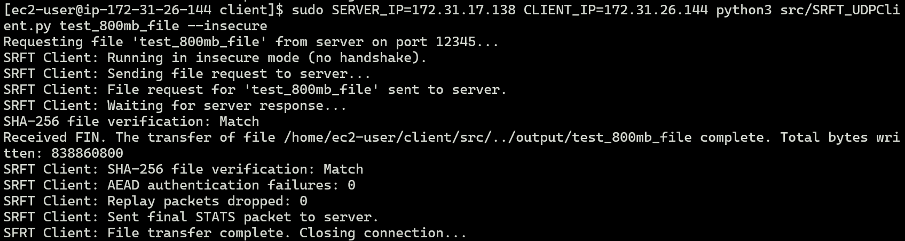 | 00:02:08 |
| test_1gb_file   | 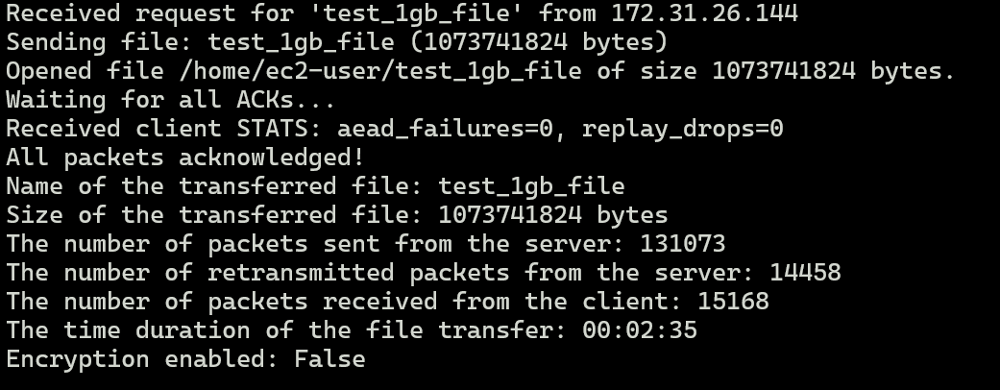   | 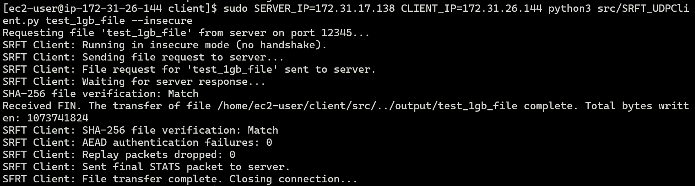   | 00:02:35 |

MD5 checksums of the original and received files:

```
f1c9645dbc14efddc7d8a322685f26eb  test_10mb_file
2f282b84e7e608d5852449ed940bfc51  test_100mb_file
d8b61b2c0025919d5321461045c8226f  test_500mb_file
4067155e98ab9e162baab0b6341f275a  test_800mb_file
cd573cfaace07e7949bc0c46028904ff  test_1gb_file
```

## Packet Loss Performance

### 2% Packet Loss

| File Name       | Server Report Screenshot     | Client Report Screenshot     | Time     |
| --------------- | ---------------------------- | ---------------------------- | -------- |
| test_10mb_file  | 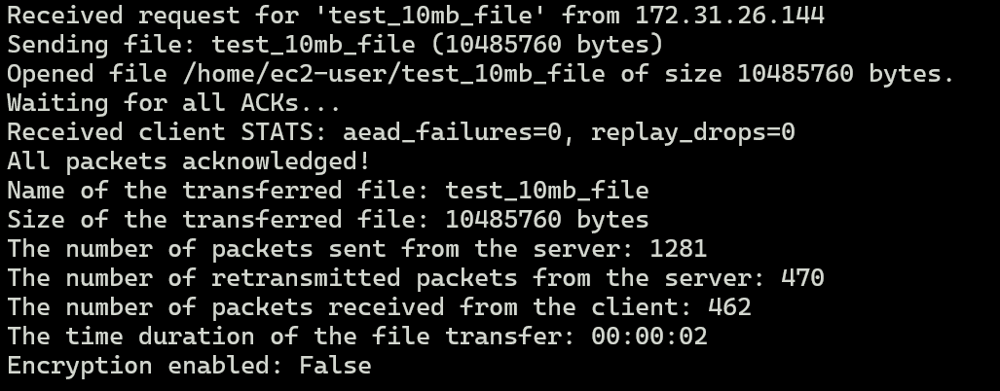  | 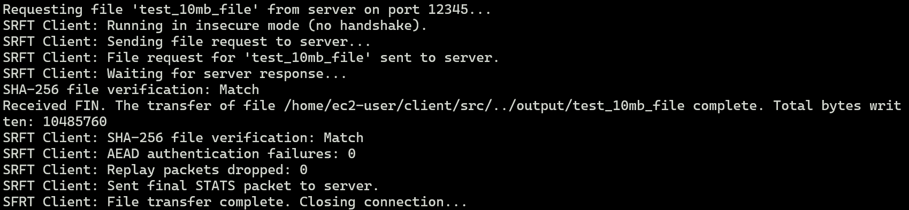  | 00:00:02 |
| test_100mb_file | 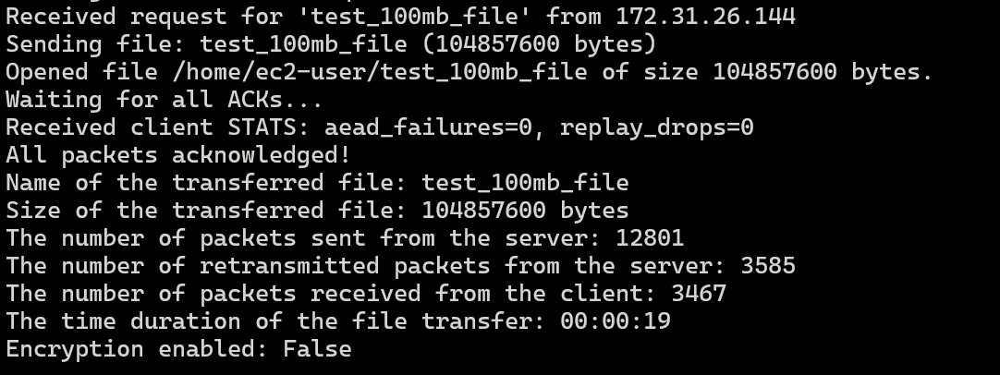 | 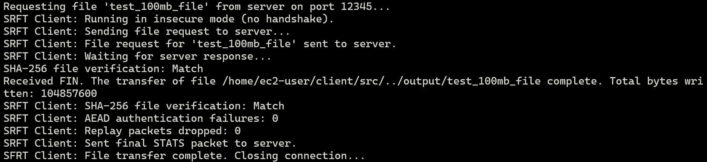 | 00:00:19 |
| test_500mb_file | 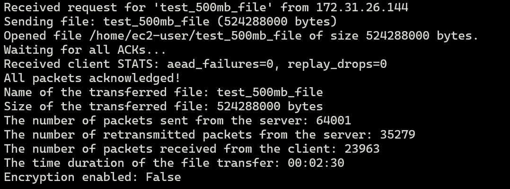 | 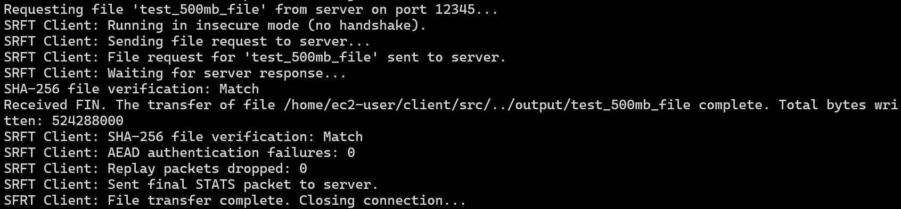 | 00:02:30 |
| test_800mb_file | 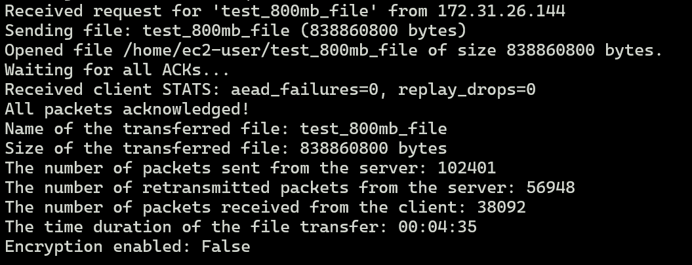 | 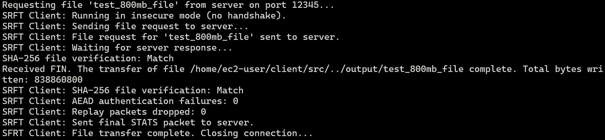 | 00:04:35 |
| test_1gb_file   | 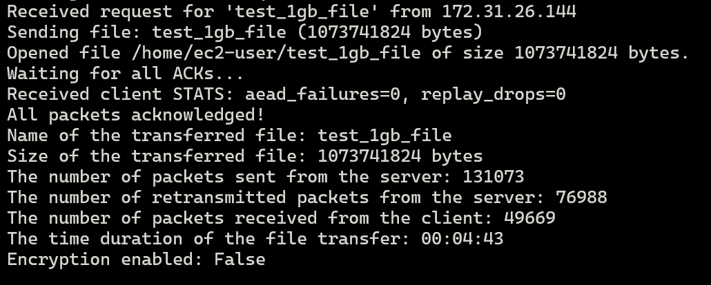   | 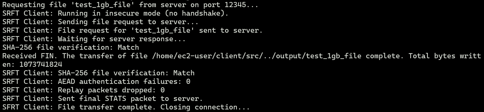   | 00:04:43 |

### 4% Packet Loss

| File Name       | Server Report Screenshot     | Client Report Screenshot     | Time     |
| --------------- | ---------------------------- | ---------------------------- | -------- |
| test_10mb_file  | 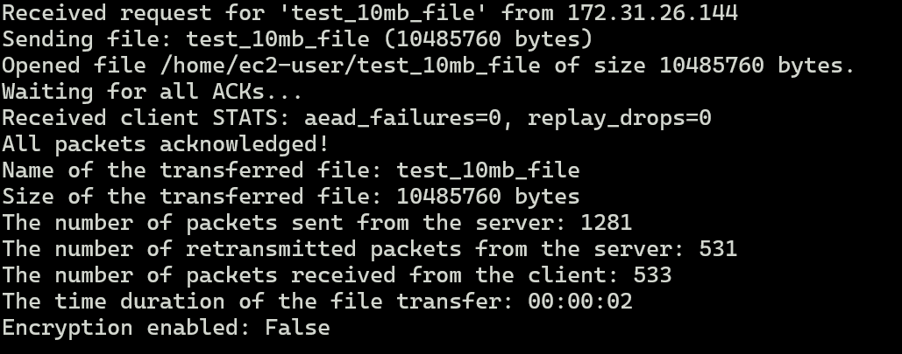  | 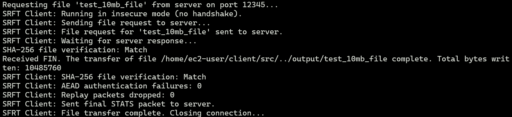  | 00:00:02 |
| test_100mb_file | 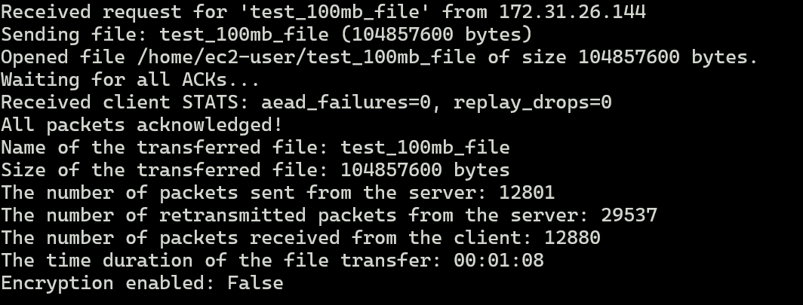 | 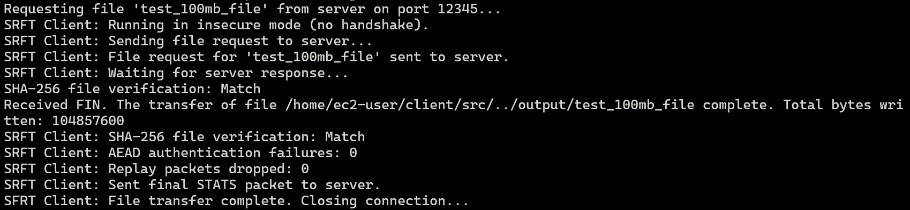 | 00:01:08 |
| test_500mb_file | 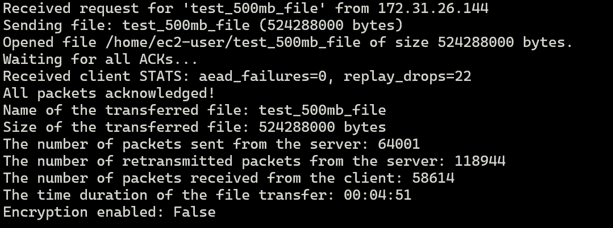 | 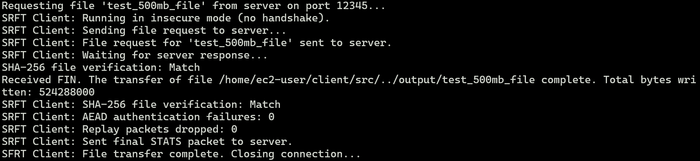 | 00:04:51 |
| test_800mb_file | 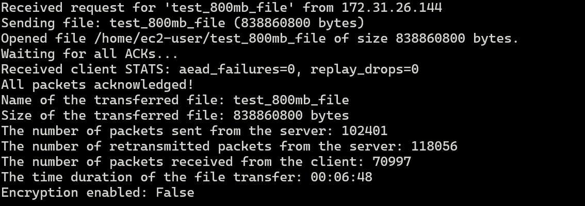 | 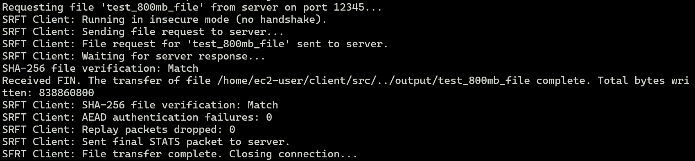 | 00:06:48 |
| test_1gb_file   | 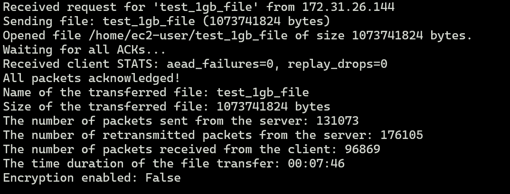   | 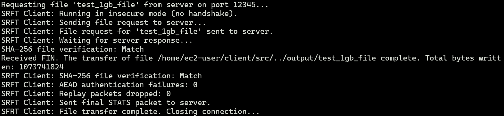   | 00:07:46 |
